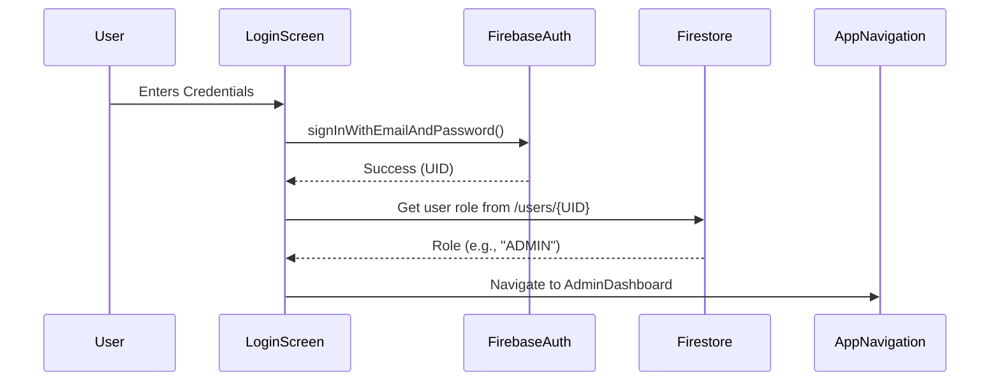
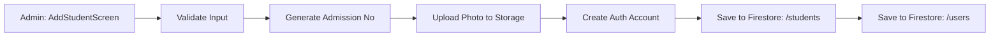

# 🏫 School Management System (schmng) - Technical Project Report

## 📝 Executive Summary
The **School Management System (schmng)** is a comprehensive, enterprise-grade Android application built with **Kotlin** and **Jetpack Compose**. It serves as a centralized platform for managing school operations, including student/teacher administration, real-time attendance tracking, fee management, and automated scheduling. The system leverages **Firebase** for its backend, providing real-time data synchronization, secure authentication, and scalable cloud storage.

---

## 🏗️ 1. System Architecture & Tech Stack

### 1.1 Core Technologies
- **Language**: Kotlin 1.9+ (Coroutines, Flow, Serialization)
- **UI Framework**: Jetpack Compose (Declarative UI, Material 3)
- **Architecture**: MVVM (Model-View-ViewModel)
- **Backend-as-a-Service**: Google Firebase
    - **Firestore**: NoSQL Database for real-time data.
    - **Authentication**: Secure email/password and Google Sign-In.
    - **Storage**: Cloud storage for profile photos and documents.
    - **Cloud Functions**: Server-side logic (e.g., automated notifications).
    - **Remote Config**: Dynamic app behavior management.
- **Dependency Management**: Gradle (Kotlin DSL) with Version Catalogs (`libs.versions.toml`).
- **Image Loading**: Coil (optimized for Compose).
- **Automation**: Fastlane (CI/CD) and Python (Data Generation).

### 1.2 High-Level Data Flow
1. **User Interaction**: User triggers an event in a Compose Screen.
2. **State Management**: The Screen observes a `StateFlow` from a `ViewModel`.
3. **Business Logic**: The `ViewModel` processes the event and calls the `FirestoreDatabase` singleton.
4. **Data Persistence**: `FirestoreDatabase` performs asynchronous operations using Kotlin Coroutines (`await()`).
5. **Real-time Update**: Firestore listeners notify the `ViewModel`, which updates the `StateFlow`, triggering a UI recomposition.

---

## 📂 2. Detailed Module Analysis (File-by-File)

### 🔑 2.1 Core & Entry Points
#### `MainActivity.kt`
The primary activity and entry point.
- **`onCreate()`**: Initializes Firebase, Analytics, and Remote Config. Sets up the `AppNavigation` host.
- **`checkForAppUpdate()`**: Implements the Google Play Core API for flexible in-app updates.
- **`setupInitialState()`**: Determines if the user is logged in and routes them to the appropriate dashboard based on their role stored in `SharedPreferences`.
- **`determineInitialRoute()`**: A critical logic block that fetches the user's role from Firestore if not found locally.

#### `SplashActivity.kt`
Handles the cold-start experience, branding, and pre-fetching of essential configuration data.

---

### 🧭 2.2 Navigation & Routing
#### `AppNavigation.kt`
The central hub for all screen transitions.
- **`NavHost`**: Defines the entire navigation graph.
- **`composable()`**: Maps string routes (e.g., `"admin_dashboard"`) to screen functions.
- **`navArgument()`**: Handles type-safe parameter passing (e.g., passing a `studentId` to a profile screen).

#### `BottomNavItem.kt` & `StudentBottomNavItem.kt`
Sealed classes defining the structure of the bottom navigation bars for different user roles (Admin vs. Student).

---

### 📊 2.3 Data Models (`/models`)
These classes define the "Shape" of the data throughout the app.

| File | Description | Key Properties |
|:---|:---|:---|
| `User.kt` | Base user profile | `id`, `email`, `type` (Admin/Teacher/Student), `fullName` |
| `Student.kt` | Detailed student record | `admissionNumber`, `rollNumber`, `parentPhone`, `isActive` |
| `TeacherData.kt` | Teacher-specific info | `department`, `designation`, `assignedClasses` |
| `AttendanceRecord.kt` | Daily attendance entry | `studentId`, `date`, `status` (Present/Absent/Leave) |
| `Notice.kt` | School announcements | `title`, `content`, `targetAudience`, `timestamp` |
| `LeaveApplication.kt` | Staff leave requests | `applicantId`, `reason`, `startDate`, `status` (Pending/Approved) |

---

### 🧠 2.4 Business Logic (ViewModels)
ViewModels act as the "Brain" of each screen, surviving configuration changes.

#### `AttendanceViewModel.kt`
- **`loadUsers(userType)`**: Fetches a list of students or staff for attendance marking.
- **`loadAttendance(date)`**: Retrieves existing records for a specific day.
- **`updatePendingStatus(id, status)`**: Manages a local map of changes before they are committed to the database.
- **`saveAttendance()`**: Commits all pending changes to Firestore in a single batch operation.

#### `TeacherDashboardViewModel.kt`
- **`loadTeacherData()`**: Fetches the logged-in teacher's profile and assigned classes.
- **`calculateAttendanceStats()`**: Aggregates attendance data to show real-time percentages on the dashboard.
- **`setupTimeSlotsListener()`**: Listens for changes in the school timetable.

---

### ⚙️ 2.5 The Data Engine (`FirestoreDatabase.kt`)
A massive repository class (2900+ lines) containing all backend interaction logic.

**Key Functions & Logic:**
- **`generateAndReserveAdmissionNumber()`**: 
    - *Logic*: Uses a Firestore Transaction to read the current counter, increment it, and write it back atomically.
    - *Purpose*: Prevents duplicate admission numbers in a multi-user environment.
- **`validateAadharNumber(number)`**: 
    - *Logic*: Implements the **Verhoeff Algorithm** (checksum validation) to ensure the 12-digit Aadhar number is valid.
- **`markAttendance(records)`**: 
    - *Logic*: Uses `WriteBatch` to update multiple documents simultaneously, ensuring data consistency.
- **`uploadProfilePhoto(uri)`**: 
    - *Logic*: Compresses the image using `Compressor` library before uploading to Firebase Storage to save bandwidth and storage.

---

## 🎨 3. UI & User Experience

### 3.1 Screen Architecture
Every screen (e.g., `AdminDashboardScreen.kt`, `AttendanceScreen.kt`) follows a consistent pattern:
1. **State Observation**: `val state by viewModel.state.collectAsState()`.
2. **Scaffold**: Provides the top bar, bottom bar, and snackbar host.
3. **Content**: Uses `LazyColumn` for lists and `ConstraintLayout` or `Box/Column/Row` for complex layouts.
4. **Animations**: Uses `AnimatedVisibility` and `animateContentSize` for smooth transitions.

### 3.2 Reusable Components (`/ui/components`)
- **`CommonBackground`**: A consistent gradient background used across the app.
- **`InfoCard`**: A standardized card for displaying data points.
- **`AnalyticsPieChart`**: A custom-drawn Canvas component for visualizing attendance and fee data.

---

## 🔄 4. Process Flowcharts

### 4.1 User Authentication Flow

### 4.2 Student Registration Flow

---

## 🛠️ 5. Automation & DevOps

### 5.1 Python Helper Scripts
- **`generate_dummy_students.py`**: Uses `faker` and `firebase-admin` to populate the database for stress testing.
- **`generate_dummy_teachers.py`**: Creates teacher accounts with randomized schedules.

### 5.2 Fastlane Integration
Located in `/fastlane`, these scripts automate:
- **`beta`**: Building the APK and uploading to Firebase App Distribution.
- **`release`**: Building the AAB (Android App Bundle) and uploading to Google Play Console.

### 5.3 Docker Environment
The `Dockerfile` provides a consistent build environment containing:
- OpenJDK 17
- Android SDK (Platform 34, Build Tools 34.0.0)
- Gradle 8.x

---

## 🔒 6. Security & Data Integrity
- **Firestore Rules**: Restrict data access based on user roles (e.g., students cannot see other students' fee details).
- **Input Validation**: Regex-based validation for emails, phone numbers, and custom formats like Admission Numbers (`ADM-YYYY-NNNNNN`).
- **ProGuard/R8**: Obfuscates code and removes unused resources in the release build to prevent reverse engineering.

---

## 🔮 7. Conclusion & Future Scope
The **schmng** app is a robust foundation for school digitalization. Its modular architecture allows for easy expansion into:
- **AI-Driven Insights**: Predicting student drop-out risks.
- **LMS Integration**: Online assignments and grading.
- **IoT Integration**: RFID-based automated attendance.

---
**Project Owner**: Yeswanth Kasi
**Last Updated**: December 30, 2025
